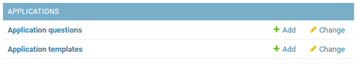

# Applications
Applications enable users to submit applications based on your existing `Application Template` objects. These are configured in the Admin Panel. 

Extensions may extend upon applications, for example, `django-eveonline-connector` adds a character view. 

## Configuring Applications

You'll typically just be editing Application Templates here. If you have questions about the fields, reach out to us in [Discord](/#discord-server). 