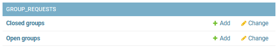

# Group Requests
There's not much to group requests, once you enable them you'll see a new `Groups` tab under your sidebar. 

## Configuring Groups
The following will be found in your Admin Panel. 

* Open Groups are groups that don't require acceptance.
* Closed Groups are groups that are hidden from the request menu.